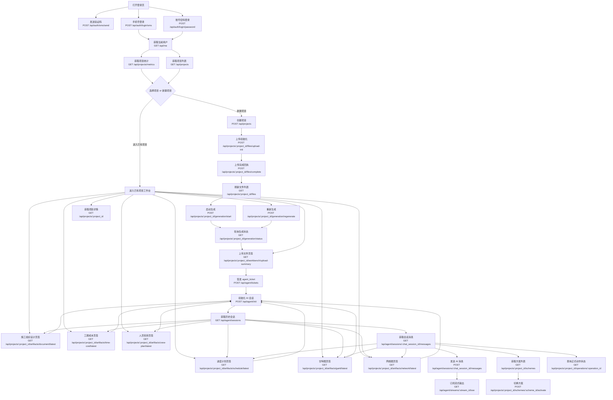
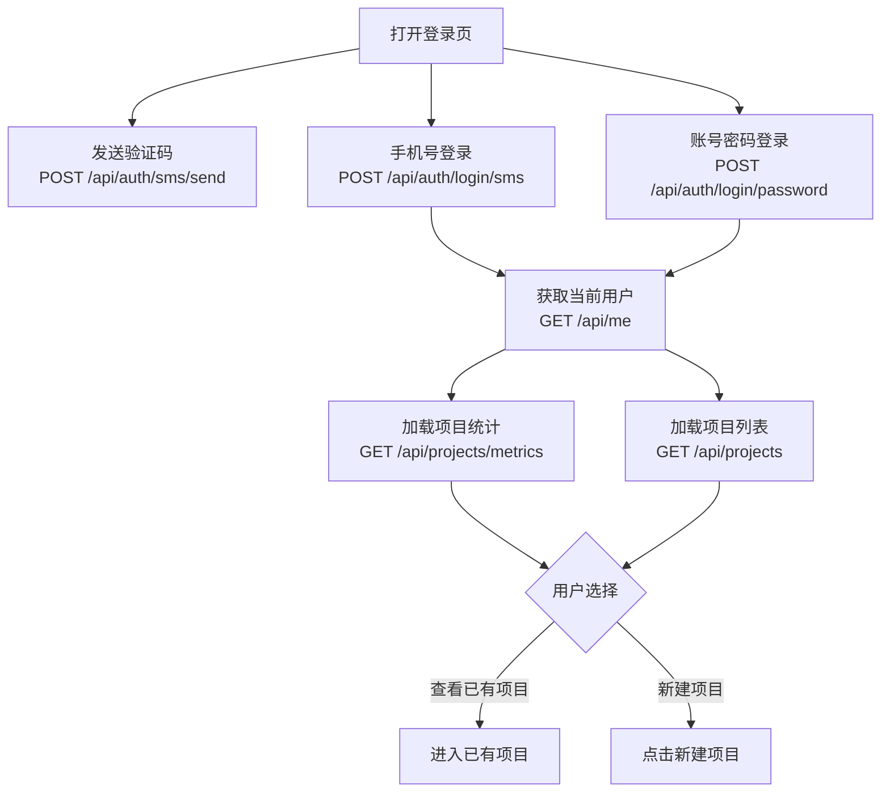
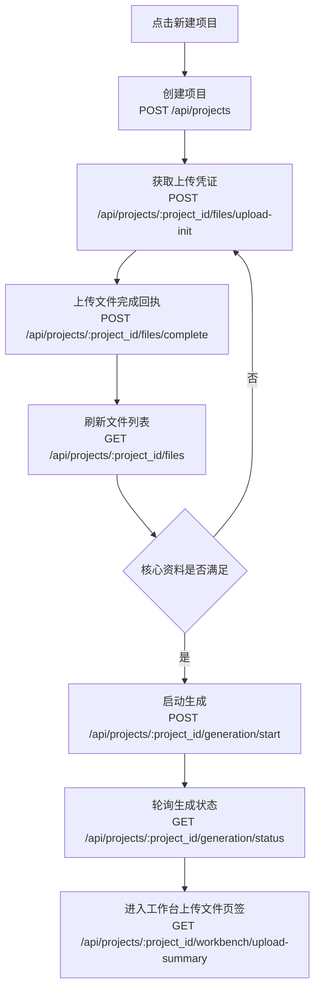
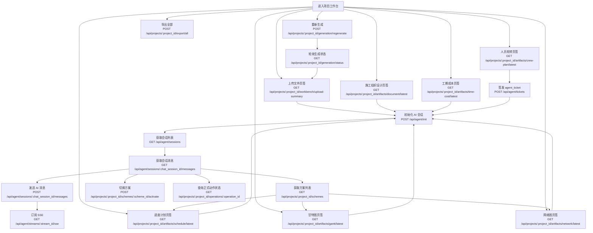
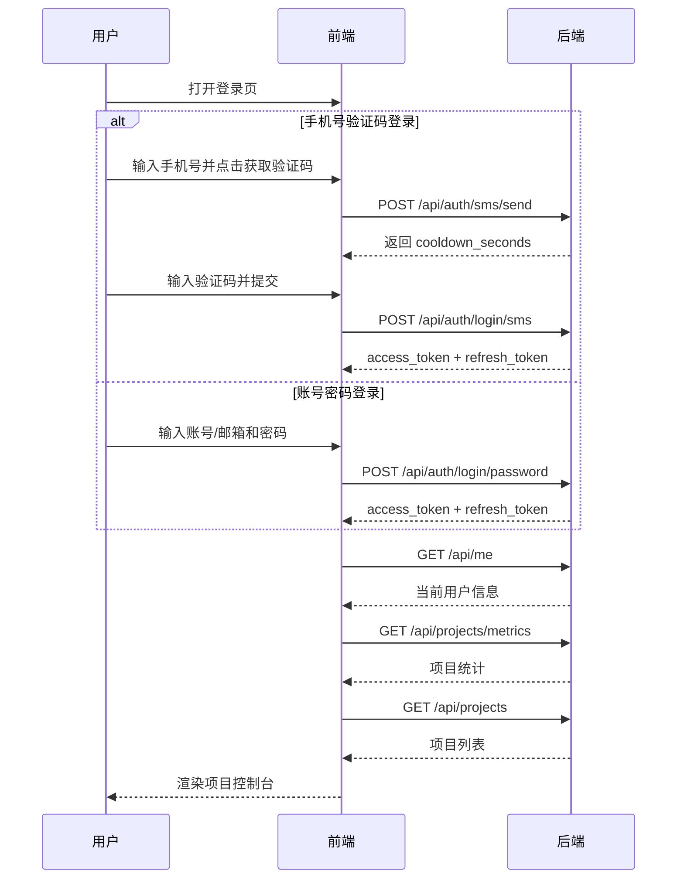
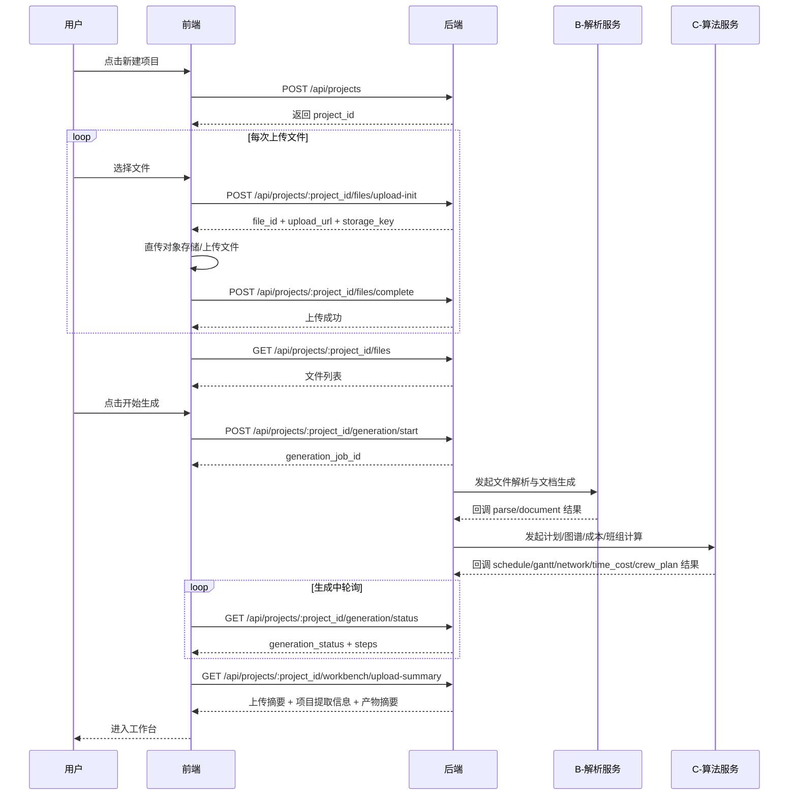
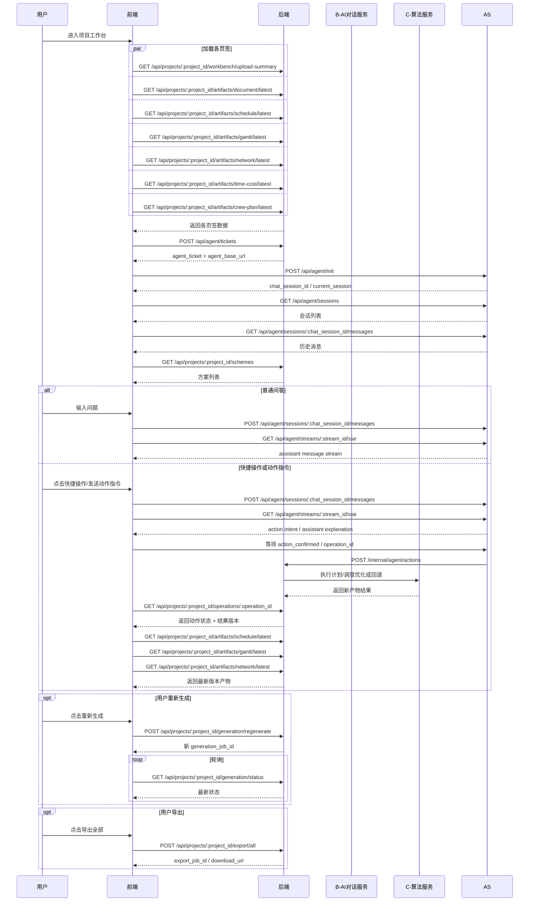

# A.PM 智管 前端接口字段版

## 1. 文档目的

本文档面向 A 同事和后端负责人 wawaup，用于明确前端页面实际消费的接口、请求参数、响应字段和字段含义。
其中 APM 后端已实现接口以当前代码与 OpenAPI 为准；`agent-service` 对话接口在此仅保留前端协作视角说明，不代表由本仓提供实现。

当前 AI 助手边界补充说明：

- `agent-service` 负责 AI 对话实时链路、历史 `session`、消息记录、项目级知识库检索
- APM 后端负责项目正式业务数据、方案切换、工序版本、正式动作结果和当前版本查询
- 因此前端 AI 相关接口需要拆成：
  - `agent-service 对话域`
  - `APM 后端项目动作域`
    - 含 `agent_ticket`
    - 含方案列表与切换
    - 含正式动作状态查询

字段基线来源：

- [apm-data-dictionary-and-api-examples.md](/Users/admin/dev/tianyou/apm-backend/docs/backend-related/apm-data-dictionary-and-api-examples.md)

## 2. 前端接口总览

| 页面/模块             | 方法     | 路径                                                      | 说明                                             |
| --------------------- | -------- | --------------------------------------------------------- | ------------------------------------------------ |
| 登录页                | `POST`   | `/api/auth/login/password`                                | 账号密码登录                                     |
| 登录页                | `POST`   | `/api/auth/login/sms`                                     | 手机验证码登录                                   |
| 登录页                | `POST`   | `/api/auth/sms/send`                                      | 发送验证码                                       |
| 全局                  | `GET`    | `/api/me`                                                 | 获取当前用户                                     |
| 项目控制台            | `GET`    | `/api/projects`                                           | 获取项目列表                                     |
| 项目控制台            | `GET`    | `/api/projects/metrics`                                   | 获取项目统计                                     |
| 上传页                | `POST`   | `/api/projects`                                           | 创建项目                                         |
| 上传页                | `POST`   | `/api/projects/{project_id}/files/upload-init`            | 获取上传凭证                                     |
| 上传页                | `POST`   | `/api/projects/{project_id}/files/complete`               | 上传完成回执                                     |
| 上传页                | `GET`    | `/api/projects/{project_id}/files`                        | 获取文件列表                                     |
| 上传页                | `DELETE` | `/api/projects/{project_id}/files/{file_id}`              | 删除文件                                         |
| 上传页                | `POST`   | `/api/projects/{project_id}/generation/start`             | 启动生成                                         |
| 上传页                | `GET`    | `/api/projects/{project_id}/generation/status`            | 查询生成状态                                     |
| 工作台/上传文件       | `GET`    | `/api/projects/{project_id}/workbench/upload-summary`     | 获取上传文件页签数据                             |
| 工作台/文档           | `GET`    | `/api/projects/{project_id}/artifacts/document/latest`    | 获取施工组织设计                                 |
| 工作台/进度计划       | `GET`    | `/api/projects/{project_id}/artifacts/schedule/latest`    | 获取进度计划                                     |
| 工作台/甘特图         | `GET`    | `/api/projects/{project_id}/artifacts/gantt/latest`       | 获取甘特图                                       |
| 工作台/网络图         | `GET`    | `/api/projects/{project_id}/artifacts/network/latest`     | 获取网络图                                       |
| 工作台/工期成本       | `GET`    | `/api/projects/{project_id}/artifacts/time-cost/latest`   | 获取工期成本分析                                 |
| 工作台/人员轮转       | `GET`    | `/api/projects/{project_id}/artifacts/crew-plan/latest`   | 获取人员轮转                                     |
| AI 助手/APM 后端      | `POST`   | `/api/agent/tickets`                                      | 签发 `agent_ticket`，供前端直连 `agent-service`  |
| AI 助手/agent-service | `POST`   | `/api/agent/init`                                         | 初始化 AI 会话上下文，外部服务接口               |
| AI 助手/agent-service | `GET`    | `/api/agent/sessions`                                     | 获取当前用户在当前项目下的会话列表，外部服务接口 |
| AI 助手/agent-service | `GET`    | `/api/agent/sessions/{chat_session_id}/messages`          | 获取指定会话消息记录，外部服务接口               |
| AI 助手/agent-service | `POST`   | `/api/agent/sessions/{chat_session_id}/messages`          | 发送 AI 消息，外部服务接口                       |
| AI 助手/agent-service | `GET`    | `/api/agent/streams/{stream_id}/sse`                      | 订阅 AI 流式输出，外部服务接口                   |
| 工作台/方案           | `GET`    | `/api/projects/{project_id}/schemes`                      | 获取项目施工方案列表                             |
| 工作台/方案           | `POST`   | `/api/projects/{project_id}/schemes/{scheme_id}/activate` | 切换当前激活方案                                 |
| 工作台/动作           | `GET`    | `/api/projects/{project_id}/operations/{operation_id}`    | 查询正式动作状态                                 |
| 工作台                | `POST`   | `/api/projects/{project_id}/generation/regenerate`        | 重新生成                                         |
| 工作台                | `GET`    | `/api/projects/{project_id}`                              | 获取项目详情                                     |

## 3. 用户使用流程图

### 3.1 主流程图

### 3.2 登录与项目控制台流程图

### 3.3 新建项目与上传生成流程图

### 3.4 工作台与 AI 对话流程图

### 3.5 前端联调时序图

#### 3.5.1 登录与项目控制台时序图

#### 3.5.2 新建项目、上传文件与生成时序图

#### 3.5.3 工作台、AI 对话与结果刷新时序图

### 3.6 流程说明

| 流程步骤 | 用户动作                       | 对应接口                                                       |
| -------- | ------------------------------ | -------------------------------------------------------------- |
| 1        | 打开登录页并选择登录方式       | 无                                                             |
| 2        | 手机号登录前发送验证码         | `POST /api/auth/sms/send`                                      |
| 3        | 提交手机号验证码登录           | `POST /api/auth/login/sms`                                     |
| 4        | 提交账号密码登录               | `POST /api/auth/login/password`                                |
| 5        | 登录成功后获取当前用户         | `GET /api/me`                                                  |
| 6        | 进入项目控制台后加载统计卡     | `GET /api/projects/metrics`                                    |
| 7        | 加载项目列表                   | `GET /api/projects`                                            |
| 8        | 新建项目                       | `POST /api/projects`                                           |
| 9        | 上传文件前获取上传凭证         | `POST /api/projects/{project_id}/files/upload-init`            |
| 10       | 文件上传完成后通知后端         | `POST /api/projects/{project_id}/files/complete`               |
| 11       | 刷新已上传文件列表             | `GET /api/projects/{project_id}/files`                         |
| 12       | 启动 AI 生成                   | `POST /api/projects/{project_id}/generation/start`             |
| 13       | 轮询生成状态和步骤             | `GET /api/projects/{project_id}/generation/status`             |
| 14       | 查看上传文件页签               | `GET /api/projects/{project_id}/workbench/upload-summary`      |
| 15       | 查看施工组织设计页签           | `GET /api/projects/{project_id}/artifacts/document/latest`     |
| 16       | 查看进度计划页签               | `GET /api/projects/{project_id}/artifacts/schedule/latest`     |
| 17       | 查看甘特图页签                 | `GET /api/projects/{project_id}/artifacts/gantt/latest`        |
| 18       | 查看网络图页签                 | `GET /api/projects/{project_id}/artifacts/network/latest`      |
| 19       | 查看工期成本分析页签           | `GET /api/projects/{project_id}/artifacts/time-cost/latest`    |
| 20       | 查看人员轮转页签               | `GET /api/projects/{project_id}/artifacts/crew-plan/latest`    |
| 21       | 签发 agent 访问票据            | `POST /api/agent/tickets`                                      |
| 22       | 打开 AI 助手并初始化会话上下文 | `POST /api/agent/init`                                         |
| 23       | 获取当前项目下的会话列表       | `GET /api/agent/sessions`                                      |
| 24       | 查看指定会话的消息记录         | `GET /api/agent/sessions/{chat_session_id}/messages`           |
| 25       | 发送对话消息                   | `POST /api/agent/sessions/{chat_session_id}/messages`          |
| 26       | 订阅 AI 流式输出               | `GET /api/agent/streams/{stream_id}/sse`                       |
| 27       | 获取施工方案列表               | `GET /api/projects/{project_id}/schemes`                       |
| 28       | 切换激活施工方案               | `POST /api/projects/{project_id}/schemes/{scheme_id}/activate` |
| 29       | 查询正式动作状态               | `GET /api/projects/{project_id}/operations/{operation_id}`     |
| 30       | 重新生成项目产物               | `POST /api/projects/{project_id}/generation/regenerate`        |
| 31       | 获取项目详情                   | `GET /api/projects/{project_id}`                               |

## 4. 登录页

### 4.1 发送验证码

`POST /api/auth/sms/send`

请求字段：

| 字段名  | 类型   | 必填 | 含义   |
| ------- | ------ | ---- | ------ |
| `phone` | string | 是   | 手机号 |

响应 `data` 字段：

| 字段名             | 类型    | 含义       |
| ------------------ | ------- | ---------- |
| `phone`            | string  | 手机号     |
| `cooldown_seconds` | integer | 倒计时秒数 |
| `sent_at`          | string  | 发送时间   |

### 4.2 手机验证码登录

`POST /api/auth/login/sms`

请求字段：

| 字段名             | 类型    | 必填 | 含义         |
| ------------------ | ------- | ---- | ------------ |
| `phone`            | string  | 是   | 手机号       |
| `sms_code`         | string  | 是   | 验证码       |
| `has_agreed_terms` | boolean | 是   | 是否同意协议 |

响应 `data` 字段：

| 字段名          | 类型   | 含义     |
| --------------- | ------ | -------- |
| `access_token`  | string | 访问令牌 |
| `refresh_token` | string | 刷新令牌 |
| `expires_at`    | string | 过期时间 |
| `user`          | object | 当前用户 |

### 4.3 账号密码登录

`POST /api/auth/login/password`

请求字段：

| 字段名             | 类型    | 必填 | 含义               |
| ------------------ | ------- | ---- | ------------------ |
| `account`          | string  | 是   | 用户账号（手机号） |
| `password`         | string  | 是   | 密码               |
| `has_agreed_terms` | boolean | 是   | 是否同意协议       |

**重要说明**：

- `account` 字段存储手机号，是用户登录的唯一标识符
- `username` 字段仅用于显示用户名称，不能用于登录
- 首次通过短信验证码登录后，用户需要调用 `/api/auth/setup-profile` 接口设置用户名和密码
- 设置密码后，用户可以使用 `account`（手机号）+ 密码的方式登录

响应 `data` 字段：

| 字段名          | 类型   | 含义         |
| --------------- | ------ | ------------ |
| `access_token`  | string | 访问令牌     |
| `refresh_token` | string | 刷新令牌     |
| `expires_at`    | string | 过期时间     |
| `user`          | object | 当前用户信息 |

### 4.4 设置用户资料

`POST /api/auth/setup-profile`

**使用场景**：

- 用户首次通过短信验证码登录后，需要设置用户名和密码
- 用户的 `is_profile_completed` 字段为 `false` 时，前端应引导用户完成资料设置

请求字段：

| 字段名     | 类型   | 必填 | 含义                   |
| ---------- | ------ | ---- | ---------------------- |
| `username` | string | 是   | 用户名，用于显示       |
| `password` | string | 是   | 密码，用于后续密码登录 |

响应 `data` 字段：

| 字段名                 | 类型    | 含义                        |
| ---------------------- | ------- | --------------------------- |
| `user_id`              | string  | 用户 ID                     |
| `username`             | string  | 用户名                      |
| `account`              | string  | 账号（手机号）              |
| `is_profile_completed` | boolean | 资料是否完成，设置后为 true |

**字段说明**：

- `username` 仅用于显示，不能用于登录
- `account`（手机号）是登录的唯一标识符
- 设置完成后，用户可以使用账号密码登录

### 4.5 获取当前用户

### 4.4 获取当前用户

`GET /api/me`

响应 `data` 字段：

| 字段名         | 类型   | 含义     |
| -------------- | ------ | -------- |
| `user_id`      | string | 用户 ID  |
| `username`     | string | 用户名   |
| `display_name` | string | 展示名称 |
| `role`         | string | 角色编码 |
| `role_name`    | string | 角色名称 |
| `avatar_text`  | string | 头像文本 |

## 5. 项目控制台

### 5.1 获取项目统计

`GET /api/projects/metrics`

响应 `data` 字段：

| 字段名                       | 类型    | 含义               |
| ---------------------------- | ------- | ------------------ |
| `total_count`                | integer | 项目总数           |
| `in_progress_count`          | integer | 进行中项目数       |
| `ready_artifact_count`       | integer | AI 成果总数        |
| `average_generation_seconds` | integer | 平均生成耗时，秒   |
| `managed_count`              | integer | 当前用户管理项目数 |

### 5.2 获取项目列表

`GET /api/projects`

请求参数：

| 字段名      | 类型    | 必填 | 含义           |
| ----------- | ------- | ---- | -------------- |
| `status`    | string  | 否   | 项目状态筛选   |
| `keyword`   | string  | 否   | 项目名称关键词 |
| `page`      | integer | 否   | 页码           |
| `page_size` | integer | 否   | 每页条数       |

响应 `data.items[]` 字段：

| 字段名                    | 类型        | 含义                     |
| ------------------------- | ----------- | ------------------------ |
| `project_id`              | string      | 项目 ID                  |
| `project_name`            | string      | 项目名称                 |
| `short_name`              | string      | 项目简称                 |
| `location`                | string      | 地区名称                 |
| `project_type`            | string      | 项目类型名称             |
| `building_area_sqm`       | number      | 建筑面积                 |
| `contract_duration_days`  | integer     | 合同工期                 |
| `contract_amount_cents`   | integer     | 金额，单位分             |
| `contract_amount_display` | string      | 金额展示文本             |
| `ready_artifact_count`    | integer     | 已就绪成果数             |
| `progress_percent`        | integer     | 进度百分比               |
| `current_phase`           | string      | 当前阶段说明             |
| `status`                  | string      | 项目状态                 |
| `status_label`            | string      | 项目状态中文             |
| `planned_start_date`      | string      | 计划开工日期             |
| `planned_finish_date`     | string      | 计划结束日期             |
| `actual_finish_date`      | string/null | 实际完成日期             |
| `remaining_days`          | integer     | 剩余天数                 |
| `is_artifact_ready`       | boolean     | 是否可进入工作台查看成果 |
| `created_at`              | string      | 项目创建时间             |

## 6. 新建项目与上传页

### 6.1 创建项目

`POST /api/projects`

请求字段：

| 字段名         | 类型   | 必填 | 含义                           |
| -------------- | ------ | ---- | ------------------------------ |
| `project_name` | string | 否   | 项目名称，可先为空             |
| `source_type`  | string | 否   | 创建来源，默认 `manual_create` |

响应 `data` 字段：

| 字段名         | 类型   | 含义      |
| -------------- | ------ | --------- |
| `project_id`   | string | 新项目 ID |
| `project_name` | string | 项目名称  |
| `status`       | string | 默认状态  |
| `created_at`   | string | 创建时间  |

### 6.2 获取上传凭证

`POST /api/projects/{project_id}/files/upload-init`

请求字段：

| 字段名               | 类型    | 必填 | 含义                        |
| -------------------- | ------- | ---- | --------------------------- |
| `original_file_name` | string  | 是   | 原始文件名                  |
| `file_size_bytes`    | integer | 是   | 文件大小                    |
| `file_category`      | string  | 是   | 文件分类：`core` `optional` |
| `file_role`          | string  | 是   | 文件角色                    |

响应 `data` 字段：

| 字段名        | 类型   | 含义     |
| ------------- | ------ | -------- |
| `file_id`     | string | 文件 ID  |
| `upload_url`  | string | 上传地址 |
| `storage_key` | string | 存储键   |
| `expire_at`   | string | 过期时间 |

### 6.3 上传完成回执

`POST /api/projects/{project_id}/files/complete`

请求字段：

| 字段名          | 类型   | 必填 | 含义     |
| --------------- | ------ | ---- | -------- |
| `file_id`       | string | 是   | 文件 ID  |
| `storage_key`   | string | 是   | 存储键   |
| `upload_status` | string | 是   | 上传状态 |

### 6.4 获取文件列表

`GET /api/projects/{project_id}/files`

响应 `data.items[]` 字段：

| 字段名                | 类型        | 含义         |
| --------------------- | ----------- | ------------ |
| `file_id`             | string      | 文件 ID      |
| `file_category`       | string      | 文件分类     |
| `file_role`           | string      | 文件角色     |
| `original_file_name`  | string      | 文件名       |
| `file_extension`      | string      | 扩展名       |
| `file_size_bytes`     | integer     | 文件大小     |
| `page_count`          | integer     | 页数         |
| `character_count`     | integer     | 字符数       |
| `upload_status`       | string      | 上传状态     |
| `parse_status`        | string      | 解析状态     |
| `uploaded_at`         | string      | 上传时间     |
| `parsed_at`           | string      | 解析时间     |
| `parse_error_message` | string/null | 解析失败信息 |

### 6.5 启动生成

`POST /api/projects/{project_id}/generation/start`

请求字段：

| 字段名           | 类型   | 必填 | 含义                    |
| ---------------- | ------ | ---- | ----------------------- |
| `trigger_source` | string | 否   | 触发来源，默认 `manual` |

响应 `data` 字段：

| 字段名              | 类型   | 含义        |
| ------------------- | ------ | ----------- |
| `generation_job_id` | string | 生成任务 ID |
| `generation_status` | string | 生成状态    |
| `started_at`        | string | 开始时间    |

### 6.6 获取生成状态

`GET /api/projects/{project_id}/generation/status`

响应 `data` 字段：

| 字段名                  | 类型          | 含义         |
| ----------------------- | ------------- | ------------ |
| `generation_job_id`     | string        | 任务 ID      |
| `project_id`            | string        | 项目 ID      |
| `generation_status`     | string        | 任务状态     |
| `current_step_code`     | string        | 当前步骤编码 |
| `current_step_name`     | string        | 当前步骤名称 |
| `step_progress_percent` | integer       | 整体进度     |
| `started_at`            | string        | 开始时间     |
| `finished_at`           | string/null   | 结束时间     |
| `steps`                 | array<object> | 步骤列表     |

`steps[]` 字段：

| 字段名             | 类型        | 含义         |
| ------------------ | ----------- | ------------ |
| `step_code`        | string      | 步骤编码     |
| `step_name`        | string      | 步骤名称     |
| `step_order`       | integer     | 步骤序号     |
| `step_status`      | string      | 步骤状态     |
| `step_started_at`  | string/null | 步骤开始时间 |
| `step_finished_at` | string/null | 步骤结束时间 |

## 7. 工作台公共接口字段

### 7.1 导出全部

`POST /api/projects/{project_id}/export/all`

响应 `data` 字段：

| 字段名          | 类型   | 含义        |
| --------------- | ------ | ----------- |
| `export_job_id` | string | 导出任务 ID |
| `export_status` | string | 导出状态    |

### 7.2 重新生成

`POST /api/projects/{project_id}/generation/regenerate`

响应 `data` 字段：

| 字段名                          | 类型   | 含义               |
| ------------------------------- | ------ | ------------------ |
| `generation_job_id`             | string | 新任务 ID          |
| `generation_status`             | string | 新任务状态         |
| `replaces_artifact_version_map` | object | 被替换的旧版本映射 |

## 8. 上传文件页签

`GET /api/projects/{project_id}/workbench/upload-summary`

响应 `data` 字段：

| 字段名             | 类型   | 含义              |
| ------------------ | ------ | ----------------- |
| `primary_file`     | object | 主文件摘要        |
| `project_info`     | object | AI 提取的项目信息 |
| `artifact_summary` | object | 产物摘要          |

### 8.1 `primary_file`

| 字段名               | 类型    | 含义     |
| -------------------- | ------- | -------- |
| `file_id`            | string  | 文件 ID  |
| `original_file_name` | string  | 文件名   |
| `page_count`         | integer | 页数     |
| `character_count`    | integer | 字符数   |
| `uploaded_at`        | string  | 上传时间 |
| `parse_status`       | string  | 解析状态 |

### 8.2 `project_info`

| 字段名                           | 类型    | 含义            |
| -------------------------------- | ------- | --------------- |
| `project_name`                   | string  | 项目全称        |
| `project_subtitle`               | string  | 项目副标题      |
| `location`                       | string  | 项目地点        |
| `building_area_sqm`              | number  | 建筑面积        |
| `contract_duration_days`         | integer | 合同工期        |
| `quality_standard`               | string  | 质量标准        |
| `contract_amount_cents`          | integer | 发包价          |
| `control_amount_cents`           | integer | 控制价          |
| `employer_name`                  | string  | 建设单位/招标人 |
| `employer_contact_name`          | string  | 联系人          |
| `qualification_requirement_text` | string  | 资质要求        |
| `funding_source`                 | string  | 资金来源        |
| `bid_evaluation_method`          | string  | 评标方式        |

### 8.3 `artifact_summary`

| 字段名                      | 类型    | 含义             |
| --------------------------- | ------- | ---------------- |
| `document_word_count`       | integer | 文档字数         |
| `schedule_task_count`       | integer | 工序数           |
| `gantt_total_duration_days` | integer | 甘特图总工期     |
| `network_status`            | string  | 网络图状态       |
| `crew_group_count`          | integer | 班组数           |
| `time_cost_status`          | string  | 工期成本分析状态 |

## 9. 施工组织设计页签

`GET /api/projects/{project_id}/artifacts/document/latest`

响应 `data` 字段：

| 字段名              | 类型          | 含义            |
| ------------------- | ------------- | --------------- |
| `artifact_id`       | string        | 产物 ID         |
| `artifact_type`     | string        | 固定 `document` |
| `artifact_version`  | integer       | 版本号          |
| `artifact_status`   | string        | 产物状态        |
| `is_latest_version` | boolean       | 是否最新版本    |
| `generated_at`      | string        | 生成时间        |
| `document_title`    | string        | 文档标题        |
| `chapter_count`     | integer       | 章节数          |
| `word_count`        | integer       | 字数            |
| `can_edit`          | boolean       | 是否可编辑      |
| `toc_items`         | array<object> | 目录列表        |
| `content_markdown`  | string        | 文档正文        |

## 10. 进度计划页签

`GET /api/projects/{project_id}/artifacts/schedule/latest`

**重要说明**：

- 接口路径保持为 `/schedule/latest` 以保持向后兼容
- 但返回的 `artifact_type` 字段值为 `graph`
- 进度计划、甘特图、网络图三种绘图方式在数据库层面已统一为 `graph` 类型
- 这三种类型共享相同的底层数据结构，只是前端展示方式不同

响应 `data` 字段：

| 字段名                | 类型          | 含义                                                        |
| --------------------- | ------------- | ----------------------------------------------------------- |
| `artifact_id`         | string        | 产物 ID                                                     |
| `artifact_type`       | string        | 固定 `graph`（进度计划、甘特图、网络图统一使用 graph 类型） |
| `artifact_version`    | integer       | 版本号                                                      |
| `artifact_status`     | string        | 产物状态                                                    |
| `is_latest_version`   | boolean       | 是否最新版本                                                |
| `total_duration_days` | integer       | 总工期                                                      |
| `task_count`          | integer       | 总任务数                                                    |
| `critical_task_count` | integer       | 关键任务数                                                  |
| `tasks`               | array<object> | 任务列表                                                    |

`tasks[]` 字段：

| 字段名                 | 类型          | 含义                               |
| ---------------------- | ------------- | ---------------------------------- |
| `task_id`              | string        | 任务 ID                            |
| `sequence_no`          | integer       | 序号                               |
| `task_name`            | string        | 任务名称                           |
| `crew_type_name`       | string        | 工种名称，标识该任务需要的工种类型 |
| `crew_count`           | integer       | 工种人数，标识该任务需要的工人数量 |
| `duration_days`        | integer       | 工期                               |
| `start_date`           | string        | 开始日期                           |
| `end_date`             | string        | 完成日期                           |
| `predecessor_task_ids` | array<string> | 前置任务 ID                        |
| `predecessor_display`  | string        | 前置展示串                         |
| `task_status`          | string        | 任务状态                           |
| `indent_level`         | integer       | 缩进层级                           |
| `is_summary_task`      | boolean       | 是否汇总                           |
| `is_critical_task`     | boolean       | 是否关键任务                       |

**字段说明**：

- `crew_type_name` 和 `crew_count` 是新增字段，用于标识每个任务所需的工种类型和人数
- 这两个字段与人员轮转页签的数据关联，用于班组调度和人员配置分析

## 11. 甘特图页签

`GET /api/projects/{project_id}/artifacts/gantt/latest`

**重要说明**：

- 接口路径保持为 `/gantt/latest` 以保持向后兼容
- 但返回的 `artifact_type` 字段值为 `graph`
- 甘特图与进度计划使用相同的 `graph` 类型，共享相同的底层数据结构
- 甘特图数据实际上也包含 `tasks` 数组，与进度计划共享相同的任务数据结构
- 前端可以根据需要将 `tasks` 数组转换为甘特图的可视化展示

响应 `data` 字段：

| 字段名                | 类型          | 含义                                                                           |
| --------------------- | ------------- | ------------------------------------------------------------------------------ |
| `artifact_id`         | string        | 产物 ID                                                                        |
| `artifact_type`       | string        | 固定 `graph`（进度计划、甘特图、网络图统一使用 graph 类型）                    |
| `artifact_version`    | integer       | 版本号                                                                         |
| `artifact_status`     | string        | 状态                                                                           |
| `timeline_start_date` | string        | 时间轴起始日期                                                                 |
| `timeline_end_date`   | string        | 时间轴结束日期                                                                 |
| `default_granularity` | string        | 默认粒度                                                                       |
| `tasks`               | array<object> | 任务列表，与进度计划共享相同的数据结构，包含 crew_type_name 和 crew_count 字段 |
| `gantt_items`         | array<object> | 甘特任务条列表（可选，用于前端渲染优化）                                       |

## 12. 网络图页签

`GET /api/projects/{project_id}/artifacts/network/latest`

**重要说明**：

- 接口路径保持为 `/network/latest` 以保持向后兼容
- 但返回的 `artifact_type` 字段值为 `graph`
- 网络图与进度计划、甘特图使用相同的 `graph` 类型，共享相同的底层数据结构
- 网络图通过节点和边的方式展示任务之间的依赖关系

响应 `data` 字段：

| 字段名                  | 类型          | 含义                                                        |
| ----------------------- | ------------- | ----------------------------------------------------------- |
| `artifact_id`           | string        | 产物 ID                                                     |
| `artifact_type`         | string        | 固定 `graph`（进度计划、甘特图、网络图统一使用 graph 类型） |
| `artifact_version`      | integer       | 版本号                                                      |
| `artifact_status`       | string        | 状态                                                        |
| `critical_node_count`   | integer       | 关键节点数                                                  |
| `critical_path_summary` | string        | 关键路径摘要                                                |
| `nodes`                 | array<object> | 节点列表                                                    |
| `edges`                 | array<object> | 边列表                                                      |

`nodes[]` 字段：

| 字段名             | 类型    | 含义                         |
| ------------------ | ------- | ---------------------------- |
| `node_id`          | integer | 节点编号                     |
| `node_name`        | string  | 节点名称                     |
| `duration_days`    | integer | 工期                         |
| `crew_type_name`   | string  | 工种名称（如果节点关联任务） |
| `crew_count`       | integer | 工种人数（如果节点关联任务） |
| `es`               | integer | 最早开始                     |
| `ef`               | integer | 最早完成                     |
| `ls`               | integer | 最迟开始                     |
| `lf`               | integer | 最迟完成                     |
| `tf`               | integer | 总时差                       |
| `is_critical_node` | boolean | 是否关键节点                 |
| `position_x`       | number  | 节点坐标 X                   |
| `position_y`       | number  | 节点坐标 Y                   |

**字段说明**：

- `crew_type_name` 和 `crew_count` 字段在节点关联具体任务时提供，用于展示该节点对应任务的工种信息
- 这些字段与进度计划和人员轮转数据保持一致

## 13. 工期-成本分析页签

`GET /api/projects/{project_id}/artifacts/time-cost/latest`

响应 `data` 字段：

| 字段名                     | 类型          | 含义             |
| -------------------------- | ------------- | ---------------- |
| `artifact_id`              | string        | 产物 ID          |
| `artifact_type`            | string        | 固定 `time_cost` |
| `artifact_version`         | integer       | 版本号           |
| `artifact_status`          | string        | 状态             |
| `contract_duration_days`   | integer       | 合同工期         |
| `optimal_duration_days`    | integer       | 最优工期         |
| `minimum_total_cost_cents` | integer       | 最低总成本       |
| `saving_rate_percent`      | number        | 节约比例         |
| `recommendation`           | object        | AI 建议          |
| `options`                  | array<object> | 方案列表         |

## 14. 人员轮转页签

`GET /api/projects/{project_id}/artifacts/crew-plan/latest`

响应 `data` 字段：

| 字段名             | 类型          | 含义             |
| ------------------ | ------------- | ---------------- |
| `artifact_id`      | string        | 产物 ID          |
| `artifact_type`    | string        | 固定 `crew_plan` |
| `artifact_version` | integer       | 版本号           |
| `artifact_status`  | string        | 状态             |
| `crew_types`       | array<object> | 工种分组列表     |

`crew_types[]` 字段：

| 字段名           | 类型          | 含义     |
| ---------------- | ------------- | -------- |
| `crew_type_code` | string        | 工种编码 |
| `crew_type_name` | string        | 工种名称 |
| `color_hex`      | string        | 颜色     |
| `crew_count`     | integer       | 班组数   |
| `crews`          | array<object> | 班组列表 |

## 15. AI 助手与项目历史

### 15.1 agent-service 对话域

说明：

- `agent-service` 负责对话初始化、历史会话、消息记录、流式输出
- 一账号多项目，每项目多 `chat_session`
- 会话和消息支持回到过去 `session` 继续对话

#### 15.1.1 初始化 AI 会话

`POST /api/agent/init`

请求字段：

| 字段名         | 类型   | 必填 | 含义                              |
| -------------- | ------ | ---- | --------------------------------- |
| `product_code` | string | 是   | 产品编码，当前为 `apm`            |
| `project_id`   | string | 是   | 项目 ID                           |
| `agent_ticket` | string | 是   | APM 后端签发的短期 agent 访问票据 |

响应 `data` 字段：

| 字段名            | 类型    | 含义         |
| ----------------- | ------- | ------------ |
| `chat_session_id` | string  | 当前会话 ID  |
| `is_new_session`  | boolean | 是否新建会话 |

#### 15.1.2 获取会话列表

`GET /api/agent/sessions`

请求参数：

| 字段名         | 类型   | 必填 | 含义     |
| -------------- | ------ | ---- | -------- |
| `product_code` | string | 是   | 产品编码 |
| `project_id`   | string | 是   | 项目 ID  |

响应 `data.items[]` 字段：

| 字段名            | 类型   | 含义         |
| ----------------- | ------ | ------------ |
| `chat_session_id` | string | 会话 ID      |
| `session_title`   | string | 会话标题     |
| `last_message_at` | string | 最后消息时间 |

#### 15.1.3 获取会话消息

`GET /api/agent/sessions/{chat_session_id}/messages`

响应 `data` 字段：

| 字段名            | 类型          | 含义     |
| ----------------- | ------------- | -------- |
| `chat_session_id` | string        | 会话 ID  |
| `messages`        | array<object> | 消息列表 |

`messages[]` 字段：

| 字段名         | 类型   | 含义     |
| -------------- | ------ | -------- |
| `message_id`   | string | 消息 ID  |
| `message_role` | string | 角色     |
| `message_type` | string | 消息类型 |
| `content_text` | string | 文本内容 |
| `sent_at`      | string | 发送时间 |

#### 15.1.4 发送消息与流式输出

`POST /api/agent/sessions/{chat_session_id}/messages`

请求字段：

| 字段名         | 类型   | 必填 | 含义         |
| -------------- | ------ | ---- | ------------ |
| `content_text` | string | 是   | 用户输入内容 |

响应 `data` 字段包含用于订阅流式输出的 `stream_id`。

流式输出接口：

`GET /api/agent/streams/{stream_id}/sse`

### 15.2 APM 后端项目动作域

说明：

- 当前前端直接依赖的 APM 后端能力包括：`agent_ticket`、方案列表/切换、正式动作状态查询
- 正式动作的提交入口是 `agent-service -> /internal/agent/actions`，不是前端直接调用
- 回退按新增 `revert_action` 处理，动作结果会落成新的工序版本

#### 15.2.1 签发 agent 访问票据

`POST /api/agent/tickets`

请求字段：

| 字段名         | 类型   | 必填 | 含义                          |
| -------------- | ------ | ---- | ----------------------------- |
| `product_code` | string | 是   | 固定传 `apm`                  |
| `project_id`   | string | 是   | 当前项目 ID                   |
| `grant_type`   | string | 是   | 固定传 `project_agent_access` |

响应 `data` 字段：

| 字段名                  | 类型          | 含义                            |
| ----------------------- | ------------- | ------------------------------- |
| `agent_ticket`          | string        | 访问 `agent-service` 的短期票据 |
| `ticket_type`           | string        | 票据类型                        |
| `expires_at`            | string        | 过期时间                        |
| `refresh_after_seconds` | integer       | 建议刷新秒数                    |
| `scopes`                | array<string> | 权限范围                        |
| `agent_base_url`        | string        | `agent-service` 基础地址        |

#### 15.2.2 获取项目方案列表

`GET /api/projects/{project_id}/schemes`

响应 `data.items[]` 字段：

| 字段名                       | 类型         | 含义               |
| ---------------------------- | ------------ | ------------------ |
| `scheme_id`                  | string       | 方案 ID            |
| `scheme_name`                | string       | 方案名称           |
| `scheme_type`                | string       | 方案类型           |
| `is_active`                  | boolean      | 是否为当前激活方案 |
| `current_process_version_id` | string/null  | 当前工序版本 ID    |
| `process_version_count`      | integer      | 方案内工序版本数   |
| `total_duration_days`        | integer/null | 当前总工期         |
| `planned_start_date`         | string/null  | 当前计划开工日     |
| `planned_finish_date`        | string/null  | 当前计划完工日     |

#### 15.2.3 激活施工方案

`POST /api/projects/{project_id}/schemes/{scheme_id}/activate`

响应 `data` 字段：

| 字段名             | 类型   | 含义              |
| ------------------ | ------ | ----------------- |
| `active_scheme_id` | string | 切换后激活方案 ID |
| `activated_at`     | string | 切换时间          |

#### 15.2.4 查询正式动作状态

`GET /api/projects/{project_id}/operations/{operation_id}`

说明：

- 前端通过 `agent-service` 拿到 `operation_id` 后，轮询本接口查看正式动作执行进度
- `action_type = revert_action` 时表示回退动作；回退目标版本或目标动作存放在动作参数里
- `action_type = task_compression` 时表示单工序压缩，动作参数里会带 `task_id` 和 `target_finish_date`

响应 `data` 字段：

| 字段名                      | 类型        | 含义                                                                                          |
| --------------------------- | ----------- | --------------------------------------------------------------------------------------------- |
| `operation_id`              | string      | 正式动作 ID                                                                                   |
| `status`                    | string      | 动作状态，`accepted` `running` `succeeded` `failed`                                           |
| `action_type`               | string      | 动作类型，当前支持 `global_compression` `task_compression` `unexpected_event` `revert_action` |
| `scheme_id`                 | string      | 作用的方案 ID                                                                                 |
| `generation_job_id`         | string/null | 关联生成任务 ID                                                                               |
| `source_dataset_code`       | string/null | 当前动作关联的数据集标识                                                                      |
| `scenario_type`             | string/null | 调度场景，当前支持 `global_compression` `task_compression` `unexpected_event` `revert_action` |
| `source_process_version_id` | string/null | 执行前版本 ID                                                                                 |
| `result_process_version_id` | string/null | 执行后版本 ID                                                                                 |
| `action_display_text`       | string      | 展示文案，例如“回退 local-compression”                                                        |
| `action_params`             | object/null | 结构化动作参数；`task_compression` 典型字段为 `task_id` 和 `target_finish_date`               |
| `result_summary`            | string/null | 当前结果摘要                                                                                  |
| `error_code`                | string/null | 错误码                                                                                        |
| `error_message`             | string/null | 错误信息                                                                                      |
| `confirmed_at`              | string/null | 确认时间                                                                                      |
| `accepted_at`               | string/null | 受理时间                                                                                      |
| `finished_at`               | string/null | 完成时间                                                                                      |

## 16. 前端联调建议

1. 优先冻结 `project_id`、`artifact_type`、`artifact_version`、`generation_status`
2. 前端金额显示统一优先使用后端返回的 `*_display`，计算场景使用 `*_amount_cents`
3. 前端图表绘制优先消费结构化字段，不依赖拼接展示文本
4. AI 助手流式协议、历史会话、知识库检索属于 `agent-service` 域
5. 当前 APM 后端对前端已开放的是 `agent_ticket`、方案列表/切换和正式动作状态查询；正式动作提交由 `agent-service` 走内部接口完成
